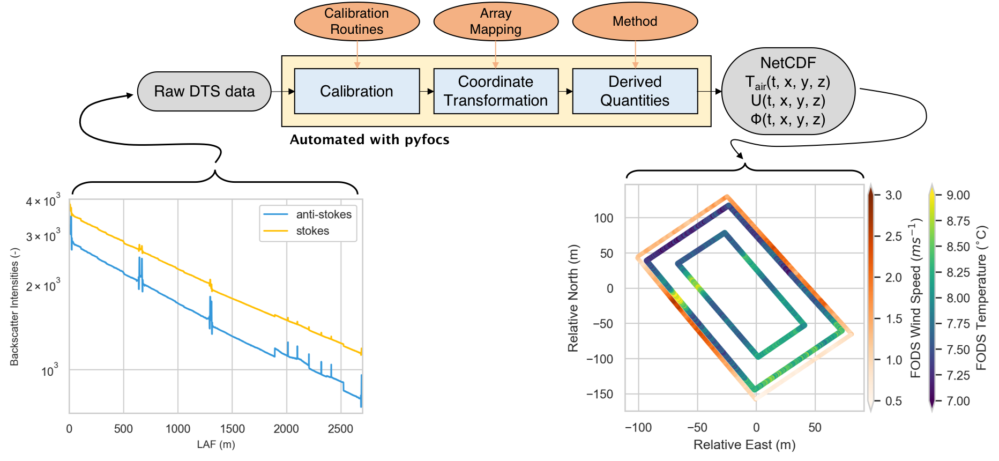

# pyfocs

version==0.5.1.

# Overview

pyfocs is the University of Bayreuth Micrometeorology python library for processing Fiber Optic Distributed Sensing (FODS) data. It is intended to streamline the handling of large and long-term DTS setups.

It automates the calibration and mapping of FODS data allowing the user to focus on the science. Calibration is robustly handled using the [dtscalibration package](https://github.com/dtscalibration/python-dts-calibration) (des Tombe, Schilperoort, and Bakker, 2020). pyfocs facilitates using an arbitrary fiber geometry, number of reference sections, and fiber calibration setup.

The library consists of the automation script (`PyFOX.py`) used to herd the data from raw format to physically labeled and calibrated data in the netcdf format (see figure). Unfortunately pyfocs only supports Silixa Distribute Temperature Sensing (DTS) devices, such as an Ultima or XT, at the moment. This library is built around the [xarray](http://xarray.pydata.org) package for handling n-dimensional data, especially in a netcdf format.

Also included are a family of functions for calculating wind speed from FODS data as well as other common statistical techniques, data manipulation, and diagnostics methods intended for use with FODS. See the example notebooks for more details.

Check out our [EGU2020 talk](notebooks/EGU2020/Schilperoort_dtscalibration_pyfocs.pdf) for an overview of both libraries.

# PyFOX Steps

Data and the surrounding directory structure is assumed to follow this outline.
.

Each Subdirectory corresponds to a particular step in the processing.

1) Archives original `.xml` files into specified time interval.

2) Creates netcdfs of the raw data, including the instrument reported temperature, stokes intensity, and anti-stokes intensity. Dimensions of Length Along the Fiber, `LAF`, and time.

3) Integrates external data streams and other reference data, performs step-loss corrections, performs the user-defined calibration based on des Tombe et al, (2020). Returns instrument reported temperature, calibrated temperature, log-power ratio of stoke and anti-stokes intensities, stokes intensity, anti-stokes intensities, and all data labels. Dimensions are `LAF` and `time`. New coordinates specified by location type in the location library can be used to label the data along with a `number of labels` by `number of LAF` coordinate.

4) Converts data labels with physical coordinates. Drops the LAF label and only includes the physical location (`xyz`) and `time`. Facilitates matching coordinates between sections for performing wind speed calculations along a common `x`, `y`, and `z` coordinate.

# Installation

This installation assumes you have the anaconda distribution of python. If you do not have anaconda see the basic [troubleshooting section](#Troubleshooting).

pyfocs can be installed by using:

`pip install pyfocs`

which installs pyfocs plus all dependencies.

If you encounter errors when running pyfocs using this method, we instead recommend installing from source. Download the source code from this repository (green button with "Clone or Download"), extract the package, navigate to the directory containing the `setup.py` file, and install using `pip install .`.

Both methods should result in the `PyFOX.py` script being callable from the command line.

# Example notebooks

We detail most steps in the processing of DTS data and provide some pointers on best practices in our example notebooks. The notebooks refer to the example data stored in this repository.

[Example 1: raw data checks](notebooks/pyfocs_ex1_rawdatacheck.ipynb) looks at how to assess data quality as it comes out of the instrument.

[Example 2: calibrated data checks](notebooks/pyfocs_ex2_calibcheck.ipynb) looks at how to assess the calibration and what decisions are available. In also details how to refine mapping of physical labels for the last step.

[Example 3: final data checks](notebooks/pyfocs_ex3_finalcheck.ipynb) looks at how DTS data are labeled with physical coordinates, how to calculate wind speed, and shows one way of quickly viewing the data.

### References

des Tombe, B.; Schilperoort, B.; Bakker, M. Estimation of Temperature and Associated Uncertainty from Fiber-Optic Raman-Spectrum Distributed Temperature Sensing. Sensors 2020, 20, 2235.

### Muppet Archiver

Batch script for scheduled archiving of `.xml` files on the Silixa DTS devices. Why muppet? Unviersity of Bayreuth Micrometeorology names their Silixa devices after muppet characters. Requires an anaconda 3.* distribution of python. Task scheduler must point to the `.bat` script and not the python script.
