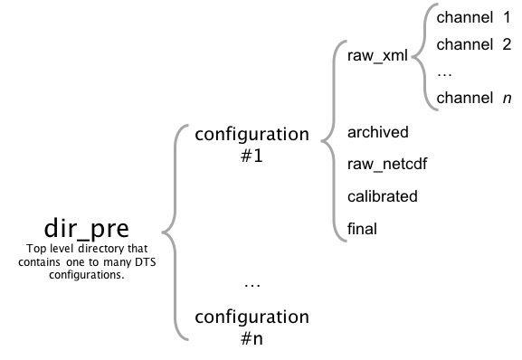

# btmm_process

## Introduction

The Bayreuth Micrometeorology python library for processing Fiber Optic Distributed Sensing (FODS) data. The library consists of a family of simple functions and a master script (`PyFOX`) that can be used to process output from a Silixa Distribute Temperature Sensing (DTS) device, such as an Ultima or XT, from the original `*.xml` files to calibrated temperatures with physical labels. This library is built around the [xarray](http://xarray.pydata.org) package for handling n-dimensional data, especially in a netcdf format.

## Other libraries

Other similar libraries exist, such as the [one developed by at Delft University](https://github.com/bdestombe/python-geotechnical-profile), which can be more useful for some applications, especially those with double-ended configurations.

## PyFOX Steps

1) Archives original `.xml` files into specified time interval.

2) Creates netcdfs of the raw data, including the instrument reported temperature, stokes intensity, and anti-stokes intensity. Dimensions of Length Along the Fiber, `LAF`, and time.

3) Labels the data, integrates external data streams and other reference data, performs step-loss corrections, performs single ended calibration based on Hausner et al., (2011). Splits multicore data into individual cores. Reports instrument reported temperature, calibrated temperature, log-power ratio of stoke and anti-stokes intensities, stokes intensity, anti-stokes intensities, and all data labels.

4) Converts data labels with physical coordinates. Drops the LAF label and only includes the physical location (`xyz`) and `time`. Re-mergeds multicore data along a `core` dimension. Cores share `xyz` and `time` dimensions.

Data and the surrounding directory structure is assumed to follow 

### References

Hausner, M. B., Suárez, F., Glander, K. E., & Giesen, N. Van De. (2011). Calibrating Single-Ended Fiber-Optic Raman Spectra Distributed Temperature Sensing Data. Sensors, 11, 10859–10879. https://doi.org/10.3390/s111110859
